# 🚚 InsightFlow: Intelligent Supply Chain Analytics

*A Cloud-Based Data Pipeline for Predictive Supply Chain Insights*

[](https://aws.amazon.com/)
[](https://spark.apache.org/)
[](https://github.com)

---

## 📘 Project Overview

**InsightFlow** is an intelligent, cloud-native supply chain analytics pipeline built on AWS infrastructure. This end-to-end data engineering solution automates the ingestion, transformation, and analysis of **DataCo Global's Supply Chain dataset**, enabling real-time insights into delivery performance, operational efficiency, and profitability.

The pipeline implements modern data warehousing principles with **dimensional modeling**, automated orchestration, and serverless compute, processing 65,000+ orders to generate actionable business intelligence.

### Key Highlights
- 🔄 **Automated ETL Pipeline** using AWS Glue and PySpark
- 📊 **Star Schema Data Warehouse** with fact and dimension tables
- ⚡ **Serverless Architecture** leveraging AWS managed services
- 🎯 **Business Intelligence** with SQL-based analytics via Athena
- 🔐 **Enterprise Security** with IAM and CloudWatch monitoring

---

## 🎯 Business Objectives

- **Improve Delivery Performance**: Identify late delivery patterns and optimize shipping modes
- **Customer Segmentation**: Analyze purchasing behavior across customer segments
- **Profit Optimization**: Track profit margins by product category and order size
- **Operational Efficiency**: Monitor shipping days and fulfillment metrics
- **Data-Driven Decisions**: Enable stakeholders to query real-time analytics

---

## 🏗️ Architecture

### System Design

The solution follows a **medallion architecture** pattern with five core layers:

```mermaid
flowchart TD
    A[📁 Raw CSV Files] -->|Upload| B[☁️ S3 Data Lake - Raw Zone]
    B -->|Schema Discovery| C[🔍 AWS Glue Crawler]
    C -->|Metadata Registration| D[📚 AWS Glue Data Catalog]
    D -->|ETL Job 1| E[⚙️ Dimension Tables Transform]
    E -->|Generate| F[👥 customer_dim<br/>📦 product_dim<br/>📋 order_dim<br/>🚚 delivery_dim]
    F -->|ETL Job 2| G[⚙️ Fact Table Aggregation]
    G -->|Join & Calculate| H[📊 fact_sales]
    H -->|Parquet Output| I[☁️ S3 Data Lake - Curated Zone]
    I -->|Catalog Update| J[📚 Glue Data Catalog - Processed]
    J -->|SQL Analytics| K[🔎 Amazon Athena]
    K -->|Business Intelligence| L[📈 InsightFlow Dashboard]
    
    style A fill:#e3f2fd
    style B fill:#fff3e0
    style E fill:#f3e5f5
    style G fill:#f3e5f5
    style I fill:#e8f5e9
    style K fill:#fce4ec
    style L fill:#e0f2f1
```



### Architecture Components

| Layer | AWS Service | Purpose |
|-------|-------------|---------|
| **Storage** | Amazon S3 | Scalable data lake for raw and processed datasets |
| **Metadata Management** | AWS Glue Data Catalog | Centralized schema registry and table definitions |
| **Schema Discovery** | AWS Glue Crawler | Automatic schema detection and metadata extraction |
| **Transformation** | AWS Glue (PySpark) | Distributed data cleaning, deduplication, and aggregation |
| **Orchestration** | AWS Step Functions | Workflow automation and job dependency management |
| **Analytics** | Amazon Athena | Serverless SQL query engine for ad-hoc analysis |
| **Security** | IAM + CloudWatch | Access control, logging, and pipeline monitoring |

---

## 📂 Data Model

### Source Files

| File | Records | Description | Key Columns |
|------|---------|-------------|-------------|
| `Customer.csv` | ~50K | Customer master data | `customer_id`, `customer_name`, `segment`, `city`, `state` |
| `Product.csv` | ~5K | Product catalog | `product_id`, `product_name`, `category_id`, `category_name` |
| `Order.csv` | ~65K | Transactional orders | `order_id`, `customer_id`, `product_id`, `quantity`, `profit_ratio` |
| `Delivery.csv` | ~65K | Shipping & logistics | `order_id`, `shipping_days`, `delivery_status`, `shipping_mode` |

### S3 Storage Structure

```
s3://insightflow-raw-data/
├── customer/
│   └── Customer.csv
├── product/
│   └── Product.csv
├── order/
│   └── Order.csv
└── delivery/
    └── Delivery.csv

s3://insightflow-processed-data/
├── dimensions/
│   ├── customer_dim/
│   ├── product_dim/
│   ├── order_dim/
│   └── delivery_dim/
└── facts/
    └── fact_sales/
```

### Star Schema Design

#### Dimension Tables

**`customer_dim`**
```sql
customer_id (PK), customer_name, customer_segment, 
customer_city, customer_state, customer_country
```

**`product_dim`**
```sql
product_id (PK), product_name, category_id, 
category_name, product_price
```

**`order_dim`**
```sql
order_id (PK), order_date, order_customer_id, 
order_product_id, order_quantity, discount_percentage
```

**`delivery_dim`**
```sql
order_id (PK), shipping_date, delivery_date, 
delivery_status, shipping_mode, shipping_days
```

#### Fact Table

**`fact_sales`**
```sql
fact_id (PK), order_id (FK), customer_id (FK), 
product_id (FK), order_date, shipping_date,
total_order_quantity, total_sales, total_discount_amount,
net_sales, avg_profit_ratio, avg_discount_rate,
order_size_category, delivery_status, shipping_mode
```

---

## ⚙️ ETL Pipeline Workflow

### Phase 1: Data Ingestion
1. **Upload CSV files** to designated S3 raw zone folders (`s3://rawdatafiles/`)
2. **Execute AWS Glue Crawler** to scan S3 and automatically infer schema
3. **Register discovered tables** in Glue Data Catalog for metadata management

### Phase 2: Dimension Table Creation (ETL Job 1 - PySpark)

**Data Quality Transformations:**

```sql
SELECT DISTINCT
    LPAD(CAST(ORDER_ID AS VARCHAR(20)), 10, '0') AS ORDER_ID,
    ORDER_CUSTOMER_ID,
    ORDER_PRODUCT_ID,
    COALESCE(ORDER_QUANTITY, 0) AS ORDER_QUANTITY,
    COALESCE(DISCOUNT_PERCENTAGE, 0) AS DISCOUNT_PERCENTAGE,
    COALESCE(DISCOUNT_RATE, 0.0) AS DISCOUNT_RATE,
    COALESCE(PROFIT_RATIO, 0.0) AS PROFIT_RATIO,
    COALESCE(PAYMENT_TYPE, 'Unknown') AS PAYMENT_TYPE,
    COALESCE(ORDER_STATUS, 'Pending') AS ORDER_STATUS,
    PRODUCT_PRICE
FROM myDataSource;
```

**Key Transformations:**
- **Remove duplicates** using `SELECT DISTINCT`
- **Standardize ORDER_ID**: Pad with leading zeros to ensure uniform 10-character format
- **Handle NULL values** with `COALESCE()`:
  - Missing quantities/percentages → 0
  - Missing payment types → 'Unknown'
  - Missing order statuses → 'Pending'
- **Data type casting** for consistency

**Output:** 4 dimension tables (`customer_dim`, `product_dim`, `order_dim`, `delivery_dim`) stored as Parquet files with Snappy compression

### Phase 3: Fact Table Aggregation (ETL Job 2)

**Join Strategy:**
```sql
SELECT 
    ROW_NUMBER() OVER (ORDER BY o.ORDER_ID) AS FACT_ID,
    o.ORDER_ID,
    o.ORDER_CUSTOMER_ID,
    c.CUSTOMER_FNAME,
    c.CUSTOMER_SEGMENT,
    o.ORDER_PRODUCT_ID,
    p.PRODUCT_NAME,
    d.SHIPPING_DATE,
    d.DELIVERY_STATUS,
    d.SHIPPING_MODE,
    -- Aggregated Metrics
    SUM(o.ORDER_QUANTITY) AS TOTAL_ORDER_QUANTITY,
    SUM(p.PRODUCT_PRICE * o.ORDER_QUANTITY) AS TOTAL_SALES,
    SUM(p.PRODUCT_PRICE * o.ORDER_QUANTITY * o.DISCOUNT_PERCENTAGE / 100) AS TOTAL_DISCOUNT_AMOUNT,
    AVG(o.DISCOUNT_RATE) AS AVG_DISCOUNT_RATE,
    AVG(o.PROFIT_RATIO) AS AVG_PROFIT_RATIO,
    -- Derived Categories
    CASE 
        WHEN SUM(o.ORDER_QUANTITY) >= 10 THEN 'Large Order'
        WHEN SUM(o.ORDER_QUANTITY) BETWEEN 5 AND 9 THEN 'Medium Order'
        ELSE 'Small Order'
    END AS ORDER_SIZE_CATEGORY,
    o.PAYMENT_TYPE,
    o.ORDER_STATUS
FROM orderDim o
INNER JOIN customerDim c ON o.ORDER_CUSTOMER_ID = c.CUSTOMER_ID
INNER JOIN productDim p ON o.ORDER_PRODUCT_ID = p.PRODUCT_ID
INNER JOIN deliveryDim d ON o.ORDER_ID = d.DELIVERY_ID
GROUP BY o.ORDER_ID, c.CUSTOMER_FNAME, c.CUSTOMER_SEGMENT, 
         p.PRODUCT_NAME, d.SHIPPING_DATE, d.DELIVERY_STATUS, 
         d.SHIPPING_MODE, o.PAYMENT_TYPE, o.ORDER_STATUS;
```

**Calculated Business Metrics:**
- **Total Sales**: `SUM(product_price × order_quantity)`
- **Discount Amount**: `SUM(sales × discount_percentage / 100)`
- **Net Sales**: `total_sales - total_discount_amount`
- **Surrogate Key**: `ROW_NUMBER()` for unique fact table identification

### Phase 4: Orchestration with AWS Step Functions

**Workflow Execution Order:**
1. **Start Crawler** → Catalog raw data
2. **Wait for Crawler** (60 seconds polling)
3. **Check Crawler Status** → Verify completion
4. **Start ETL Job 1** → Generate dimension tables
5. **Wait for ETL Job 1** completion
6. **Start ETL Job 2** → Populate fact table
7. **Wait for ETL Job 2** completion
8. **Workflow Complete** → Ready for analytics

### Phase 5: Storage & Cataloging
- **Format**: Parquet with Snappy compression (70% size reduction)
- **Partitioning**: By `order_date` for query optimization
- **Catalog Update**: Automatic schema registration with "update schema and add partitions" option
- **Query Engine**: Amazon Athena for serverless SQL analytics

---

## 📊 Analytics & Business Intelligence

### Key Performance Indicators (KPIs)

| Metric | Value | Calculation Method |
|--------|-------|-------------------|
| **Total Products Ordered** | 178K+ units | `SUM(order_quantity)` |
| **Gross Sales** | $32.0M | `SUM(total_sales)` |
| **Net Profit** | $377K | `SUM(net_sales * profit_ratio)` |
| **Orders Placed** | 65K+ | `COUNT(DISTINCT order_id)` |
| **Avg Shipping Days** | 3.8 days | `AVG(shipping_days)` |
| **On-Time Delivery Rate** | 59.7% | `COUNT(WHERE status='On Time') / COUNT(*)` |

### SQL Analytics Queries

**Profit Margin by Product Category:**
```sql
SELECT 
    category_name,
    SUM(net_sales) as total_revenue,
    SUM(net_sales * avg_profit_ratio) as total_profit,
    ROUND(AVG(avg_profit_ratio) * 100, 2) as profit_margin_pct
FROM fact_sales
GROUP BY category_name
ORDER BY total_profit DESC;
```

**Late Delivery Analysis by Shipping Mode:**
```sql
SELECT 
    shipping_mode,
    COUNT(*) as late_deliveries,
    AVG(shipping_days) as avg_delay_days
FROM fact_sales
WHERE delivery_status = 'Late'
GROUP BY shipping_mode
ORDER BY late_deliveries DESC;
```

**Customer Segment Performance (OLAP):**
```sql
SELECT 
    customer_segment,
    YEAR(order_date) as order_year,
    QUARTER(order_date) as order_quarter,
    COUNT(DISTINCT customer_id) as active_customers,
    SUM(total_sales) as segment_revenue
FROM fact_sales
GROUP BY ROLLUP(customer_segment, YEAR(order_date), QUARTER(order_date))
ORDER BY order_year, order_quarter;
```

### Dashboard Features
- 📅 **Filters**: Year, Quarter, Shipping Mode, Product Category
- 📈 **Visualizations**: Time series trends, profit margins, delivery performance
- 🎯 **Drill-Down**: Customer → Order → Product level analysis
- 🔄 **Real-Time**: Auto-refresh with latest S3 data updates

---

## 🚀 Implementation Results

### Pipeline Performance
✅ **Data Ingestion**: 100% success rate across all 4 source files  
✅ **Schema Detection**: Automatic cataloging of 20+ columns per table  
✅ **ETL Execution**: ~8 minutes total runtime for full pipeline  
✅ **Data Quality**: 0 duplicates, <0.1% null values post-cleaning  
✅ **Storage Optimization**: 70% compression ratio with Parquet format  

### Business Impact
- 📊 Identified **top 5 products** generating 40% of total revenue
- 🚚 Revealed **same-day shipping** has 22% late delivery rate
- 💰 Discovered **Consumer segment** contributes 51% of net profit
- 📉 Highlighted **Fishing category** has negative profit margin (-12%)

---

## 🔐 Security & Governance

### IAM Security Model
- **S3 Bucket Policies**: Restrict read/write access to Glue service role
- **Glue Job Permissions**: Least-privilege access to Data Catalog and CloudWatch
- **Athena Workgroup**: Query result encryption with S3-SSE
- **VPC Endpoints**: Private connectivity for Glue to S3

### Monitoring & Logging
- **CloudWatch Metrics**: Track job duration, data processed, failure rates
- **Glue Job Bookmarks**: Incremental processing for new data only
- **Athena Query History**: Audit trail of all SQL executions
- **Cost Allocation Tags**: Track spending by project component

---

## 🔮 Future Enhancements

### Phase 2 Roadmap
- [ ] **Amazon Redshift Integration**: MPP querying for sub-second analytics
- [ ] **AWS QuickSight Dashboards**: Interactive BI with drill-down capabilities
- [ ] **Lambda Triggers**: Real-time ETL on S3 file uploads
- [ ] **ML Predictions**: Late delivery forecasting with SageMaker
- [ ] **dbt Integration**: SQL-based transformations with version control
- [ ] **Data Quality Framework**: AWS Deequ for automated validation rules

### Advanced Analytics
- [ ] Customer lifetime value (CLV) modeling
- [ ] Inventory optimization with demand forecasting
- [ ] Shipping route optimization using geospatial analysis
- [ ] Anomaly detection for fraud prevention

---

## 👥 Project Team

| Name | Role | Responsibilities |
|------|------|-----------------|
| **Krithika Annaswamy Kannan** | Data Engineer & ETL Architect | Pipeline design, PySpark transformations, AWS infrastructure |
| **Abhiram Varanasi** | Data Analyst & BI Developer | Data modeling, SQL analytics, dashboard development |

**Contact**: annaswamykannan.k@northeastern.edu

---

## 📚 References & Attribution

- **Dataset**: [DataCo Global Supply Chain Dataset](https://www.kaggle.com/datasets/shashwatwork/dataco-smart-supply-chain-for-big-data-analysis)
- **Attribution**: Fabian Constante, Instituto Politécnico de Leiria, Escola Superior de Tecnologia e Gestão
- **Technologies**: 
  - AWS Glue 4.0 (PySpark 3.3)
  - Amazon S3 (Standard Storage Class)
  - Amazon Athena (Engine v3)
  - AWS Step Functions (Standard Workflows)

---

## 📄 Project Metadata

- **Course**: Cloud Computing for Data Analytics (Milestone 7)
- **Institution**: Northeastern University
- **Submission Date**: December 7, 2024
- **License**: Educational Use Only

---

<div align="center">

**Built with ☁️ on AWS | Powered by 🐍 PySpark**

*For questions or collaboration opportunities, please reach out via email.*

</div>
